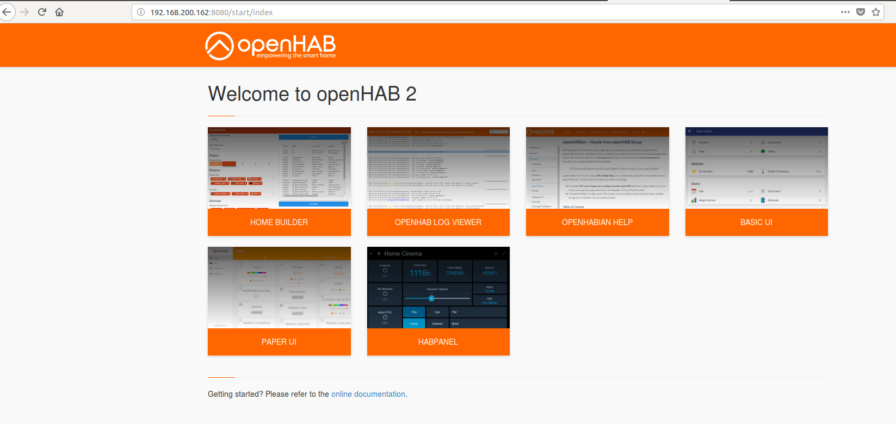
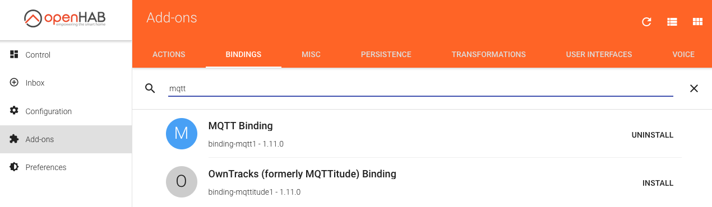
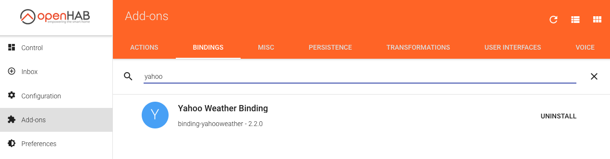
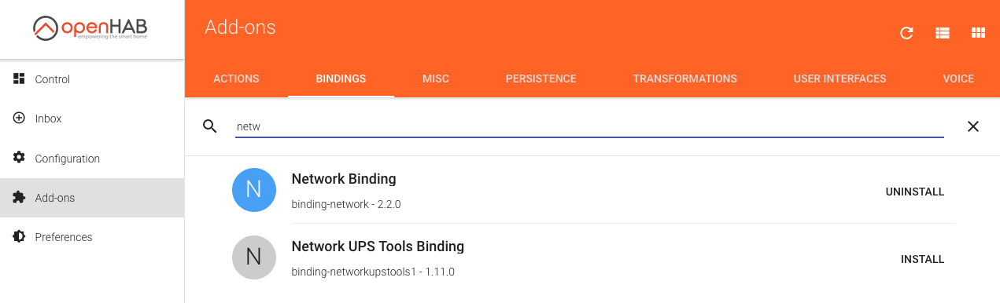
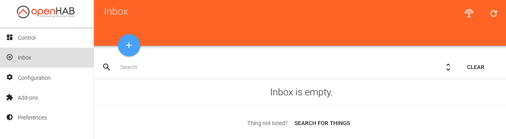

# Proyecto DAM 2017

## Iker e Iñaki

Repositorio del módulo de proyecto de Desarrollo de Aplicaciones Multiplataforma en [Egibide Arriaga](http://www.egibide.org/2/es/25/donde-nos-encontramos.html).

La carpeta [docs](./docs/) contiene el [sitio web](https://egibide-dam.github.io/proyecto-2017/) con la documentación.

### Introducción
El proyecto consta de dos partes.
1. Recepción de datos del Photon en servidor mosquitto, registro en base de datos MySQL a través de aplicación Java y visualización de gráficas en página Web. Control de la calefacción mediante plataforma OPENHABIAN, creando "things", items y reglas. Regulación con termostato y presencia detectada por la luz o telefonos móviles.
2. Control con termostato y presencia mediante la Web y la aplicación Java. Evitando las reglas de Openhabian.

### Control de calefactor con OpenHabian
Controlaremos un calefactor con una Raspberry Pi con la distribución OpenHabianPi instalada, un stick USB Zwave y un switch Zwave. Recibiremos los datos de la estancia desde una placa Particle Photon, que a través del protocolo MQTT publica estos datos en un "Topic" en el "Broker" Mosquitto instalado en la máquina virtual scotchBox. Con una aplicación desarrollada en JAVA nos suscribimos al "topic" y registramos la temperatura, humedad y luz en una base de datos MySQL. Estos datos podremos consultarlos mediante una Web que nos mostrará una gráfica con el valor del instante y tres gráficas con el historico de los tres datos almacenados, temperatura, humedad y luz. La web, lee los registros de la base de datos MySQL.

#### Material necesario:
* [Raspberry Pi](https://www.raspberrypi.org/products/)
* [USB Zwave](http://zwave.es/AeonUsb)
* [Enchufe Zwave](http://zwave.es/FibaroWallPlugZwavePlus?search=enchufe)
* [Particle Photon](https://store.particle.io/#photon)
* [Adafruit DHT22](https://www.adafruit.com/product/385) 
* Fotoresistor, viene con el photon
* Alguna resistencia

#### Instalación
* Raspberry Pi
    * [Instalación de OpenHabianPi](https://docs.openhab.org/installation/openhabian.html), lo más cómodo es grabar una imagen del SO en un tarjeta SD.
* Particle Photon    
    * Hacemos la puesta en marcha del [Photon](https://docs.particle.io/guide/getting-started/intro/photon/), subscribiendolo a nuestra red Wi-Fi.
    * Nos logeamos en la nube de [Particle](https://login.particle.io/login?app=web-ide&redirect=https://build.particle.io/build).
    * Montamos el circuito según el esquema.
    
    [esquema](./fotos/esquema_bb.png)
    
    * Grabamos el [sketch](./Photon/Sketch_Photon.ino) en nuestro photon.
* Vagrant scotchBox
    * Instalamos la máquina virtual vagrant [scotchBox](https://github.com/Egibide/scotch-box).
    * En el fichero Vagrantfile que se encuentra en la carpeta de la máquina virtual vagrant, añadimos la siguiente línea:
    ```ruby
    config.vm.network "public_network", ip: "10.1.100.100", netmask: "255.255.255.0"
	```
    * Con esto habilitamos el acceso a la máquina virtual desde la red inforwifi, para que el photon se pueda comunicar con Mosquitto.
    * Arrancamos la máquina y nos conectamos por ssh.
    * Creamos la base de datos con el siguiente [script](./BD/CreateBD.sql).
    * Instalamos Mosquitto.
    ```bash
    sudo apt update
    sudo apt install mosquitto
    ```
    * Instalamos Java runtime.
    ```bash
    sudo apt install default-jre
    ```
    * Descargamos el repositorio en la carpeta home.
    ```bash
    cd /home
    sudo git clone https://github.com/inakidml/proyecto-2017
    ```
    * Ejecutamos el programa java.
    ```bash
    cd proyecto-2017
    cd Java_MQTT_MySQL
    cd builds
    java -jar proy.jar
    ```
    * Copiamos la web al directorio de apache
    ```bash
    sudo cp -r /home/proyecto-2017/WebProyecto /var/www/public/WebProyecto
    ```
    * Accedemos a la web del proyecto desde el explorador de la máquina anfitrión, en la dirección [http://192.168.33.10/WebProyecto/](http://192.168.33.10/WebProyecto/)
    
* OpenHabian
	* Accedemos a nuestra raspberry desde un explorador.

	

	* Añadimos los "Bindings" necesarios.

	

	

	

	* Añadimos los telefonos móviles.

		* Pulsamos sobre el simbolo \+

	
		
	* Entramos en Network Binding.		

	
	
	* seleccionamos los teléfonos
	* En Yahoo weather creamos una localización nueva.

	* Nos conectamos por ssh a la raspberry para copiar varios ficheros. La [carpeta](./openhabian/openhab2/) contiene todos los ficheros necesarios con la estructura de las carpetas.  

	```bash
	sudo cp -r /home/proyecto-2017/openhab2 etc/openhab2

	```
	* Ya podemos acceder al sitemap de control del proyecto, en el que podemos seleccionar la temperatura del termostato o activar las reglas de presencia. También podemos ver los datos climaticos de Vitoria.
	
	```bash
	http://10.1.100.100:8080/basicui/app

	```
#### Tips
* En el PaperUI de openhab se crean los "things", pero después, debemos crear un item por cada thing para poder utilizarlo en las reglas.
* Necesitamos saber el ID del "thing" para poder referenciarlo desde los items.
* El sitemap default se actualiza automaticamente. Cualquiera con otro nombre, no.

### Control de calefactor desde Web

